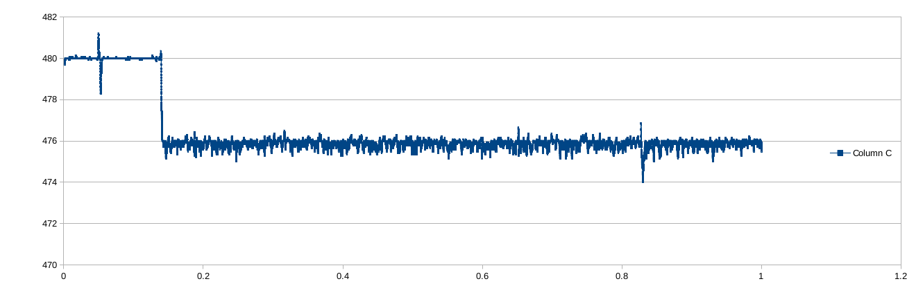

# MCP 3301 SPI Reader
Program which reads an [MCP3301](https://www.microchip.com/wwwproducts/en/MCP3301) and for each reading outputs a value,
a running average, and a timestamp on STDOUT.

The advantage to using this code lies in not having to implement the
bit-twiddling or other minutia needed to read the MCP3301 correctly.

## History

The MCP3301 ADC reader was written over the course of an evening for
use in a project involving an always-on falconry scale that could
actively monitor a bird's weight loss over time. (The code comments
were added later, though.)

The hardware took significantly longer to procure than one evening,
and it consisted of a strain gauge, connected to an in-amp, connected
to the MCP3301, connected to the Raspberry Pi. A hollow perch with
enough room for the Raspberry Pi was partially built. The electronics
were run on a breadboard, and this code was known to work. The project
was ultimately abandoned.

## Configuring

The code is minimal and will need configuring via directly modifying the
source. Two major places you may want to configure:
* The specific SPI device file that the program will try to connect to
* The read-loop exit condition

An older version of this software used a hard-coded time value for its
exit condition (e.g. "exit after exactly 1 second"). It presently has
no exit condition, and will require `ctrl-C` to terminate.

## Building

Clone the files to a Raspberry Pi:

    git clone https://github.com/Chesley-Kraniak/spi_scale_reader

Then compile the program:

    gcc spi.c -c
    gcc -lm main.c spi.o -o spi_scale_reader

## Running

From a terminal on the Raspberry Pi, execute:

    ./spi_scale_reader > out.txt

Allow the reader to read for as long as you need. When you are ready to
exit, press `ctrl-C`.

An example of real output is in [this output file](out.txt). Plotting the
values obtained results in the above graph.

## License

This project is All Rights Reserved. This means you are not permitted
to copy, modify, or use the code within unless you contact me for a license.

## Author

Chesley Kraniak, [ckraniak@live.com](mailto:ckraniak@live.com).
